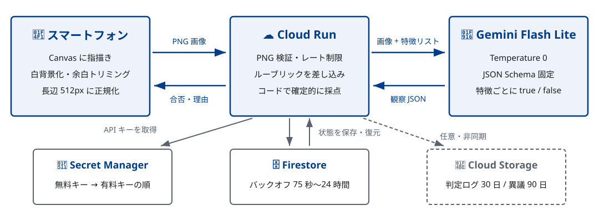

# 配線用図記号ドリル 📝


電気通信工事施工管理技士試験の設備系統図学習向け Web ドリル。スマホで指描きした JIS C 0303 記号を AI が判定し、フィードバックが得られる。

**ログイン不要・成績保存なし・URL 共有だけで利用可能**

Google AI Dojo Season 2 提出作品

---

## 🎯 特徴

### 判定の正確さ: コード + AI の組み合わせ

従来の LLM 判定のみでは判定がぶれる。本アプリは：

1. **ルーブリック定義**: 記号ごとに必須特徴・禁止特徴・類似記号を `symbols.json` で定義
2. **AI の観察**: Gemini vision が各特徴を**独立した true/false で観察**（JSON Schema 固定・temperature 0）
3. **確定的な採点**: 必須特徴がすべて満たされ、禁止特徴・類似記号がすべて false の場合のみ合格

→ 不合格時に「どの特徴が不足しているか」が構造的に分かる

### インフラ

- **DB なし、状態なし** → スケーラブル
- **Cloud Run scale to zero** → コスト最小化
- **複数 API キー対応** → 無料枠と有料枠の自動フォールバック

---

## 🏗️ システムアーキテクチャ



```
[ブラウザ] landing.html / drill.html (canvas 指描き)
     │  → PNG 正規化・トリミング
     ▼
[Cloud Run] FastAPI
     │  ルーブリック + Gemini vision
     ▼
[Gemini 3.1 Flash Lite]
     │  各特徴を true/false で観察
     ▼
[決定的採点]
```

---

## 🚀 クイックスタート

### Web で試す

デプロイ済みサービス: https://zukigou-drill-vnoxzmytga-an.a.run.app

<div style="margin: 16px 0; padding: 24px; background: #f3f4f6; border-radius: 4px; display: inline-block;">


</div>

### ローカルで実行

```bash
pip install -r requirements.txt
GEMINI_API_KEY="your-free-key" uvicorn main:app --host 0.0.0.0 --port 8080
```

詳細は [docs/DEVELOPMENT.md](docs/DEVELOPMENT.md) を参照

---

## 🛠️ 技術スタック

- **Frontend**: HTML5 Canvas + Vanilla JS
- **Backend**: FastAPI + Python
- **AI**: Gemini vision (free tier + paid tier fallback)
- **Infrastructure**: Cloud Run + Cloud Storage + Firestore
- **CI/CD**: GitHub Actions + Workload Identity Federation

---

## 📚 ドキュメント

- [docs/DEVELOPMENT.md](docs/DEVELOPMENT.md) — 開発・デプロイ手順
- [docs/ARCHITECTURE.md](docs/ARCHITECTURE.md) — システム詳細設計
- [docs/requirements.md](docs/requirements.md) — 要件書

---

## 📊 収録範囲

電気通信工事施工管理技士 第二次検定の出題実績に基づく 5 カテゴリ：

- 電話設備 / インターホン / テレビ共聴 / LAN 情報 / 放送設備

各記号は JIS C 0303:2000 規格票で検証済み

---

## 🔒 プライバシー

- ユーザー認証・成績保存なし
- 判定画像は通常保存しない
- Gemini API 呼び出しのみ外部連携

---

## 📄 免責

本アプリの判定は練習支援用であり、図記号としての正しさを保証しない。最終的な正誤の確認は JIS C 0303:2000 規格票によること。
