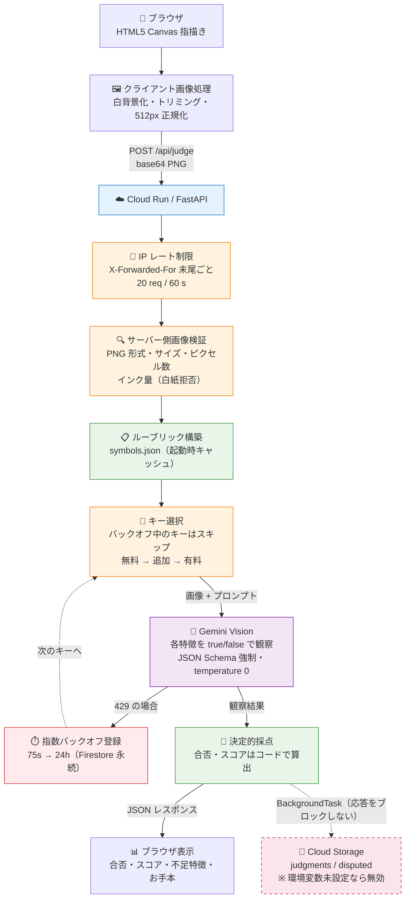

# システムアーキテクチャ

配線用図記号ドリルの詳細な技術設計。

## 全体構成



**状態を持つのはレート制限だけ**で、それも Firestore に永続化している
（インスタンス内メモリはキャッシュ兼フォールバック）。それ以外は完全にステートレスで、
Cloud Run の scale to zero がそのまま成立する。

---

## API エンドポイント

### GET /

ランディングページ。記号カテゴリー一覧・練習開始。

**応答**: HTML

### GET /drill

練習画面。Canvas 指描き → /api/judge 送信。

**応答**: HTML

### GET /standards

図記号一覧（解説ページ）。カテゴリごとにお手本 SVG・説明・判定ポイントを表示する。

**応答**: HTML

### GET /api/catalog

解説ページ用。`verified: true` の全記号について、お手本 SVG・説明・`required_features`・
`common_mistakes` を返す。

### GET /api/symbols

収録記号の一覧（`id` / `name` / `category` / `verified`）。`verified: false` も含む。

### GET /api/question

出題 API。`verified: true` のランダムな記号を返す。`description` は判定後の解説表示に使う。

**応答**:
```json
{
  "id": "kanyu_phone",
  "name": "加入電話機",
  "category": "電話設備",
  "description": "電気通信事業者の回線に直接接続する電話機。..."
}
```

### POST /api/judge

採点 API。

**リクエスト**:
```json
{
  "symbol_id": "kanyu_phone",
  "image_b64": "data:image/png;base64,iVBOR..."
}
```

**レスポンス（200 OK）**:
```json
{
  "symbol_id": "kanyu_phone",
  "passed": true,
  "score": "3/3",
  "checks": [
    { "feature": "必須: 二重の円が描かれている", "ok": true },
    { "feature": "必須: 円の中に T の文字がある", "ok": true },
    { "feature": "除外: 円が一重であるがない", "ok": true }
  ],
  "mistakes": [],
  "observation": "二重円が見られる。内側にフック形状あり。",
  "ref_svg": "<svg>...</svg>"
}
```

- `score` は `"合格数/総数"` の文字列（例 `"3/3"`）
- `checks` は `{feature, ok}` の配列
- `ref_svg` は不合格時の比較表示用お手本

**observation フィールド仕様**:
- 型: `string`
- 最大長: 500 文字
- 内容: Gemini vision による特徴観察の詳細（日本語）

**エラーレスポンス**:

エラーは FastAPI 標準の形式で返る。ボディは常に `detail` のみを持つ。

```json
{ "detail": "invalid base64 image" }
```

| ステータス | `detail` の例 | 発生条件 |
|---|---|---|
| 400 | `invalid base64 image` | base64 としてデコードできない |
| 400 | `PNG image required` | PNG 以外の形式 |
| 400 | `empty drawing` | インク量が `MIN_INK_PIXELS` 未満（ほぼ白紙） |
| 400 | `invalid PNG image` | PNG として壊れている |
| 404 | `unknown symbol` | `symbol_id` が symbols.json に存在しない |
| 413 | `image too large` | バイト数またはピクセル数が上限超過 |
| 422 | pydantic の検証エラー詳細 | リクエストボディがスキーマ不一致 |
| 429 | `しばらく待ってから再度お試しください` | IP あたりのレート制限（`RATE_LIMIT` / `RATE_WINDOW`） |
| 429 | `daily_quota_exceeded` | IP または全体の日次判定枠が枯渇 |
| 503 | `judgment service is not configured` | API キーが 1 つも設定されていない |
| 503 | `judgment service unavailable` | 全キー・全モデルが失敗（quota 枯渇・API 障害など） |

`/api/*` のエラーは常に JSON で返る（HTML の 404 ページは通常ページのみ）。
429 に `Retry-After` ヘッダは付かない。

### POST /api/report

異議報告 API。「判定に納得できない」を押したときだけ呼ばれる。リクエストは判定時に
発行した`judgment_id`だけを受け取る。Firestoreトランザクションで一度だけ報告済みにし、
再送は409、期限切れ・不明IDは404にする。`FEEDBACK_BUCKET`未設定時は503で無効化する。

### GET /healthz

プロセス生存確認。常に 200 OK。

```json
{ "ok": true }
```

> **注**: Cloud Run 上ではこのパスに Google のフロントエンドが応答し、コンテナまで
> 届かず 404（Google の HTML エラーページ）になる。デプロイ後の疎通確認には
> `/readyz` を使う。ローカル実行では通常どおり 200 が返る。

### GET /readyz

準備状態確認。

```json
{
  "ok": true,
  "symbols": 54,
  "feedback_enabled": false,
  "keys_available": 2,
  "keys_total": 3
}
```

- 200: 記号がロード済みで、バックオフ中でない API キーが 1 つ以上ある
- 503 `no symbols loaded`: symbols.json が空
- 503 `Gemini is not configured`: API キーが 1 つも設定されていない
- 503 `all Gemini API keys are rate limited`: 全キーがバックオフ中

---

## AI 判定フロー

### 1. 入力画像の検証

```python
# PNG 形式チェック
# サイズチェック (MAX_IMAGE_BYTES)
# ピクセル数チェック (MAX_IMAGE_PIXELS)
# 解像度チェック (MAX_IMAGE_DIM)
# インク量チェック (MIN_INK_PIXELS)
#   → 白紙判定で API 呼び出しスキップ
```

### 2. ルーブリック構築

```python
symbol = symbols[symbol_id]  # symbols.json から読み込み
rubric = {
  "required_features": symbol["required_features"],   # 必須特徴（全て true 必須）
  "forbidden_features": symbol["forbidden_features"],  # 禁止特徴（全て false 必須）
}
```

類似記号との弁別は、専用フィールドではなく各記号の `forbidden_features` に
判別条件として書き下す（例: 分配器なら「水平線が円を貫通して左右両側に伸びている」）。

### 3. Gemini vision 呼び出し

**JSON Schema 強制**（`response_schema=VisionResult`）で各項目を独立判定する。
特徴は番号順の boolean 配列で受け取るため、記号ごとに項目数が変わってもスキーマは同じ：

```python
class VisionResult(BaseModel):
    model_config = ConfigDict(strict=True)
    required: list[bool]    # required_features と同じ順序
    forbidden: list[bool]   # forbidden_features と同じ順序
    observation: str        # 日本語の根拠（最大 500 文字。超過分は切り詰め）
```

**プロンプトの構造**（`main.py` の `judge` を参照）:
```
必須特徴(required): 画像に存在すれば true
{ "0": "二重の円が描かれている", "1": "円の中に T の文字がある" }

禁止特徴(forbidden): 画像に存在すれば true。1つでも true なら不合格
{ "0": "円が一重である", "1": "円の中が塗りつぶされている" }

→ required / forbidden は、上記の番号(0,1,2...)に対応する true/false を
   その順序どおりに並べた配列で返す
```

### 4. 採点ロジック

```python
def judge(image_b64, symbol_id):
  # 1. IP レート制限（X-Forwarded-For 末尾ごと）
  check_rate(client_ip)               # 超過なら 429

  # 2. 画像検証（外部 API を呼ぶ前に確定させる）
  image = decode_and_validate(image_b64)   # 不正なら 400 / 413

  # 3. API キー試行順序（バックオフ中のキーはスキップ）
  for key in [GEMINI_API_KEY, *GEMINI_API_KEYS, GEMINI_PAID_API_KEY]:
    if in_backoff(key): continue
    for model in MODELS[key.tier]:
      try:
        observation = gemini.vision(image, rubric, model, key)
        break
      except RateLimitError:          # code == 429
        mark_rate_limited(key)        # Firestore+メモリに記録し、このキーは打ち切り
        break
      except Exception:
        continue                      # 次のモデルへ
  
  # 4. 採点決定（必須がすべて true、禁止がすべて false なら合格）
  checks = build_checks(observation, required, forbidden)
  passed = all(c["ok"] for c in checks)
  score  = f"{sum(c['ok'] for c in checks)}/{len(checks)}"   # 例: "7/8"

  # 5. GCS 保存（任意・BackgroundTask なので応答をブロックしない）
  if ALL_JUDGMENTS_BUCKET:
    background.add_task(save_judgment, image, symbol_id, checks, score)

  return {
    "passed": passed,
    "score": score,
    "checks": checks,
    "mistakes": [f for f in required_features if not checks[f]],
    "observation": observation
  }
```

---

## API キーとモデルの管理

### 優先順位

1. **GEMINI_API_KEY** (無料枠)
   - モデル: `GEMINI_MODELS_FREE`
   - タイムアウト: 短い
   - リトライ: 積極的

2. **GEMINI_API_KEYS** (追加無料キー)
   - モデル: `GEMINI_MODELS_FREE`
   - 1 の枯渇時に試行

3. **GEMINI_PAID_API_KEY** (有料枠)
   - モデル: `GEMINI_MODELS_PAID`
   - 最後の手段

### バックオフ戦略

API キーが 429（`code == 429` または `status == "RESOURCE_EXHAUSTED"`）を返すと、
そのキーの状態を Firestore とプロセス内メモリの両方に記録する：

```python
# メモリ（キャッシュ／Firestore 不達時のフォールバック）
_rate_limited_keys: dict[str, tuple[float, int]]   # キー → (記録時刻, 連続失敗回数)

# Firestore（永続）: rate_limits/{key} ドキュメント
# { timestamp, consecutive_count, backoff_seconds }
```

連続失敗回数に応じて待機時間が延びる：

| 連続失敗 | 1 | 2 | 3 | 4 | 5 | 6 | 7+ |
|---|---|---|---|---|---|---|---|
| 待機 | 75s | 10m | 1h | 3h | 5h | 10h | 24h |

バックオフ中のキーは `/api/judge` の試行対象から外れ、次のキーへフォールバックする。
待機時間を過ぎたキーは「制限なし」として扱われ再試行される。記録自体は残し、
次に 429 になったとき段階を引き継げるようにする（最後の 429 から 24 時間超で
経過していれば 1 から数え直す）。満了した記録の掃除は Firestore の TTL ポリシー
（`timestamp` フィールド）に委ねる。

#### Firestore で永続化する

状態を `rate_limits` コレクションに保存することで、インスタンスをまたいで一貫する。

| 事象 | 挙動 |
|---|---|
| Cloud Run のコールドスタート | Firestore から状態を復元し、バックオフを継続 |
| スケールアウト | 各インスタンスが同じ Firestore を参照し、制限を共有 |
| Firestore に到達できない | メモリにフォールバック（判定は継続、共有性のみ低下） |

Firestore 参照はレート制限判定のたびに 1 回で、低トラフィックのため無料枠に収まる。
書き込みは 429 発生時のみ。

---

## Cloud Storage スキーマ

### ALL_JUDGMENTS_BUCKET

**目的**: 全判定データの収集・分析

**保存パス**: `judgments/{date}/{symbol_id}/{uuid}.json`

```
{
  "symbol_id": "kanyu_phone",
  "passed": true,
  "score": 0.95,
  "checks": {...},
  "mistakes": [],
  "image_url": "gs://bucket/judgments/.../image.png",
  "date": "2025-01-20"
}
```

**ライフサイクル**: 30 日で自動削除

### FEEDBACK_BUCKET

**目的**: 異議報告データの収集（学習データ化）

**保存パス**: `disputed/{date}/{symbol_id}/{uuid}.json`

保存対象: ユーザーが「判定に納得できない」を押した場合のみ

**ライフサイクル**: 90 日で自動削除

---

## セキュリティ設計

### プライバシー保護

- ユーザー認証なし（ログイン機能なし）
- セッション追跡なし
- IP アドレス記録なし
- 成績保存なし

### 判定データの最小化

- 通常: 判定結果のみ返却、画像は保存しない
- 異議報告時のみ画像を保存（且つ 90 日で削除）

### API キーの保護

- キーはコード内に記載しない
- Google Cloud Secret Manager から環境変数経由でロード
- Workload Identity Federation で GitHub Actions との認証

### 入力検証

- PNG 形式必須
- サイズ・ピクセル数の上限チェック
- 白紙判定で無駄な API 呼び出し防止

### 出力検証

- Gemini API 応答は JSON Schema + Pydantic strict mode で検証
- 予期しない型は拒否

---

## スケーラビリティ

### Stateless 設計

- データベースなし
- ユーザーセッション・認証・成績保存なし
- キャッシュ戦略:
  - **symbols.json**: モジュール起動時に一度メモリにロード・キャッシュ（リクエストごとのディスク読み取りなし）
  - **genai クライアント**: API キーごとにプロセス内で再利用
  - **Gemini API 応答**: キャッシュなし（毎回 API 呼び出し）

→ **Cloud Run scale to zero** が可能。使用量に応じた自動スケール。

### 同時実行性

プロセス内で共有される可変状態は 2 つで、どちらも `threading.Lock` で保護している。

| 状態 | 用途 | スコープ |
|---|---|---|
| `_hits` | IP ごとのレート制限ウィンドウ | インスタンス内のみ |
| `_rate_limited_keys` | API キーごとのバックオフ | メモリキャッシュ＋Firestore 永続 |

`_rate_limited_keys` は Firestore に永続化されるため、再起動やスケールアウトを
またいでバックオフが共有される。一方 `_hits`（IP レート制限）はインスタンス内のみで、
複数インスタンスでは各自が独立して適用するため、実効的な IP 上限は
「インスタンス数 × RATE_LIMIT」になる。厳密に絞りたい場合は Cloud Run の
`max-instances` を併用する。

### コスト最適化

- **無料キー優先**: 無料枠のキーから順に試し、有料キーは最後の手段
- **段階的フォールバック**: 無料枠枯渇後に有料キーへ移行
- **Cloud Run scale to zero**: 利用なしで月額 $0
- **外部 API 呼び出し前の門番**: 白紙・巨大画像・レート超過はサーバー側で弾く
- **GCS ライフサイクル**: 古いデータの自動削除（保存を有効にした場合のみ）

**想定コスト**:

1 判定あたりの入力は実測 1,510〜1,641 トークン（本文 421〜552 + 画像 1,090 固定）、
出力は約 40 トークン。有料枠の単価（入力 $0.25 / 出力 $1.50 per 1M）で換算すると
**1 判定 ≈ $0.0005** で、判定数に完全に比例する。

| | 1 日 100 判定 | 1 日 1,000 判定 |
|---|---|---|
| Gemini | $1.38 | $13.80 |
| Cloud Run（scale to zero） | $0.03 | $0.31 |
| Cloud Storage（任意・既定は無効） | $0.03 | $0.30 |
| Firestore（レート制限のみ・無料枠内） | $0 | $0 |
| **合計** | **≈ $1.4 / 月** | **≈ $14.4 / 月** |

無料枠のキーで運用している間は実質 $0。画像は解像度を落としてもトークン数が
変わらない（1,090 固定）ため、コスト削減には効かない。

---

## デプロイメント

### GitHub Actions ワークフロー

**トリガー**:
- PR 作成・更新
- 手動デプロイ
- スケジュール（3 時間ごと）

**ステップ**:
1. チェックアウト
2. Python 環境構築
3. 依存関係インストール
4. テスト実行
5. Cloud Run へデプロイ（Workload Identity Federation 認証）

### 環境変数の参照

```yaml
env:
  GEMINI_API_KEY: ${GCP_SECRET_GEMINI_API_KEY}
  ALL_JUDGMENTS_BUCKET: zukigou-all-judgments
```

---

## 監視・ロギング

### Cloud Logging

**標準ログ**:
- リクエスト: メソッド、パス、ステータス、レスポンスタイム
- エラー: スタックトレース、API エラー詳細
- レート制限: キー、バックオフ秒数、試行履歴

**ログレベル**:
- INFO: リクエスト処理
- WARN: フォールバック、バックオフ開始
- ERROR: API キー枯渇、処理失敗

### ヘルスチェック

```
GET /healthz → 200 (プロセス生存)
GET /readyz  → 200/503 (記号ロード・API キー設定・全キーのバックオフ状態)
```

Cloud Run（フルマネージド）は liveness/startup probe を明示設定しない限り
これらを自動 probe しない。本サービスは probe を設定していないため、`/readyz` の 503 が
インスタンスの自動再起動を引き起こすことはない（デプロイ後の手動ヘルス確認と、
外形監視の判断材料として用いる）。probe を設定する場合は、全キーが一時的に
レート制限された 503 で再起動ループに入らないよう、readiness probe には
`/healthz` を割り当てること。

---

## 今後の拡張可能性

- [ ] ユーザー成績追跡（別アプリ or 外部 DB）
- [ ] 複数言語対応
- [ ] モデル精度検証パイプライン
- [ ] A/B テスト (ルーブリック変更の影響測定)
- [ ] 記号の自動生成（Gemini でルーブリック提案）
